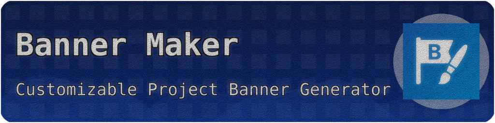

# GitHub Banner Maker



A powerful, customizable Python tool to generate modern banners for your GitHub projects. Create professional-looking banners with custom titles, subtitles, icons, colors, gradients, patterns, shapes, textures, and effects.

**Developed by [obarlik](https://github.com/obarlik) at [Codechu](https://codechu.com)**

## ✨ Features

- 🎨 **Highly Customizable**: Title, subtitle, colors, fonts, gradients
- 🖼️ **Icon Support**: PNG, JPG, SVG formats with automatic sizing  
- 🌈 **Advanced Gradients**: Vertical, horizontal, diagonal, radial gradients
- 🔷 **Pattern System**: Dots, squares, triangles, stars, hearts, lines, waves with rotation
- 🔶 **Shape Elements**: Circles, polygons, blobs, waves with customizable properties
- 🎭 **Texture Effects**: Noise, grain, concrete, leather, metal, and more
- ✨ **Visual Effects**: Bloom, glow, vintage filters, chromatic aberration
- 🔄 **Auto Color Detection**: Automatically extracts colors from your logo
- 📐 **Smart Layout**: Automatic text sizing and positioning
- 🎯 **Multiple Outputs**: Single banner or demo grid with variations
- 🎪 **60+ Built-in Presets**: Professional design templates
- 🔧 **Modern CLI Interface**: Compact syntax with extensive options

## 🚀 Quick Start

### Basic Usage
```bash
# Install dependencies
pip install -r requirements.txt

# Generate a simple banner
python banner_maker.py --title "My Project" --subtitle "Awesome Project Description"

# With custom icon
python banner_maker.py --title "My Project" --icon logo.png
```

### Advanced Usage
```bash
# Use a preset
python banner_maker.py --preset modern_blue --title "My Project"

# Generate demo grid with 60 variations
python banner_maker.py --demo

# Modern compact syntax
python banner_maker.py --title "API Docs" --bg "orange:red:diagonal" --pattern "dots:white:25" --shape "wave:blue:60"

# Multiple elements with effects
python banner_maker.py \
  --title "Data Platform" \
  --bg "purple:blue:radial" \
  --pattern "triangles:white:30" \
  --shape "polygon:cyan:40" \
  --texture "grain:20" \
  --effect "bloom:0.8" \
  --rounded "25"
```

## 📋 Parameters

### Basic Options
- `--title` - Project title (default: "Banner Maker")
- `--subtitle` - Project subtitle/slogan (default: "Customizable Project Banner Generator")
- `--icon` - Path to icon image (optional)
- `--output` - Output file name (default: "github_banner.png")

### Colors & Gradients
- `--bg-color-start` - Background gradient start color (hex)
- `--bg-color-end` - Background gradient end color (hex)
- `--text-color` - Text color (hex)
- `--gradient-type` - Gradient direction: vertical, horizontal, diagonal, radial
- `--auto-color` - Automatically use dominant colors from icon

### Patterns & Shapes (Modern Syntax)
- `--pattern` - Background patterns: "type:color:opacity" (dots, squares, triangles, stars, hearts, lines, waves)
- `--shape` - Decorative shapes: "type:color:opacity" (circle, polygon, blob, wave)
- `--texture` - Background textures: "type:opacity" (noise, grain, concrete, leather, metal)
- `--effect` - Visual effects: "type:intensity" (bloom, glow, vintage, monochrome)

### Effects & Styling
- `--rounded` - Corner radius: "value" or "tl,tr,bl,br" for individual corners
- `--intensity` - Global intensity modifier: low/medium/high
- `--contrast` - Global contrast modifier: low/medium/high

### Advanced Options
- `--min-contrast` - Minimum text-background contrast ratio
- `--shadow-opacity` - Text shadow opacity (0-255)
- `--corner-radius-tl/tr/bl/br` - Individual corner radius values
- `--padding` - Padding around text and logo (px)

### Demo & Presets
- `--demo-set` - Generate demo banner set with variations
- `--preset` - Use built-in preset (modern_blue, purple_tech, minimal_black, etc.)

## 🎨 Built-in Presets (60+ Available)

### Popular Presets
- **geometric_chaos** - Dynamic triangles with random rotation and vibrant gradients
- **polygon_constellation** - Star patterns with multiple geometric shapes
- **modern_blue** - Professional blue gradient with clean design
- **purple_tech** - Tech-style with diagonal gradients and dot patterns
- **architect_concrete** - Minimalist concrete texture with geometric elements
- **playful_rainbow** - Colorful hearts pattern for creative projects
- **vaporwave** - Retro pink-blue aesthetic with line patterns
- **ocean_waves** - Flowing wave patterns with ocean colors

### Categories
- **Professional** - business_green, github_pro, fintech_gold
- **Creative** - blob_garden, organic_blobs, nature_breeze  
- **Tech** - cyber_yellow, dark_portfolio, matrix_grid
- **Accessible** - accessible_blue_orange, bw_high_contrast
- **Artistic** - vintage_leather, textile_corduroy, pixel_art

Use `--learn PRESET_NAME` to see the CLI equivalent of any preset.

## 📦 Installation

```bash
# Clone the repository
git clone https://github.com/obarlik/banner-maker.git
cd banner-maker

# Install dependencies
pip install -r requirements.txt
```

## 🔧 Requirements

- Python 3.8+
- Pillow (PIL)
- NumPy (for noise texture effects)

## 📸 Examples

### Basic Banner
```bash
python banner_maker.py --title "My Awesome Project" --subtitle "The best tool ever created"
```

### Using Presets
```bash
python banner_maker.py --preset geometric_chaos --title "My Project"
python banner_maker.py --preset vaporwave --title "Retro App"
```

### Modern Compact Syntax
```bash
# Multi-element design
python banner_maker.py --title "AI Platform" --bg "purple:pink:radial" --pattern "stars:white:25" --effect "glow:0.6"

# Professional style
python banner_maker.py --preset architect_concrete --title "Construction Co" --intensity "high"
```

## 🎯 Output

The tool generates:
- **Single Banner**: PNG file (1024x256 px) optimized for GitHub README
- **Demo Grid**: Collection of banner variations with parameter labels
- **Log File**: Detailed parameter information for each generated banner

## 🤝 Contributing

Contributions are welcome! Please feel free to submit a Pull Request.

## 📄 License

This project is licensed under the MIT License - see the [LICENSE](LICENSE) file for details.

## 🙏 Acknowledgments

- Inspired by modern GitHub project banners
- Built with **Pillow (PIL)** for image processing
- Powered by **NumPy** for efficient numerical computations
- Designed for developer productivity

### Fonts
- **DejaVu Sans Mono** - High quality monospace font (Bitstream Vera License)
- **Inter** - Modern sans-serif font by Rasmus Andersson (SIL Open Font License)

### Optional Dependencies
- **SciPy** - Scientific computing library for advanced texture effects
- **Matplotlib** - Plotting library for data visualization features

---

**Made with ❤️ for the GitHub community** 