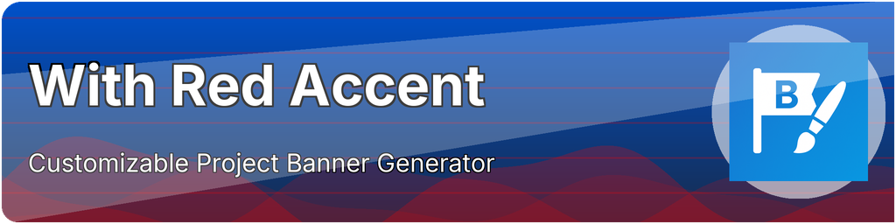
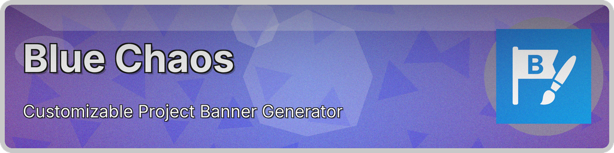
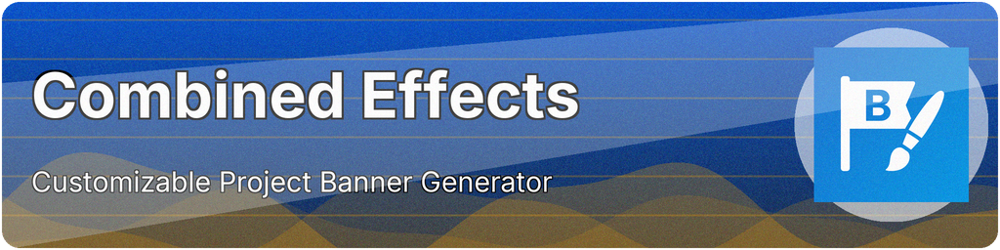

# Preset Gallery

This document showcases all available design presets for Banner Maker. Each preset is a carefully crafted combination of colors, gradients, patterns, shapes, textures, and effects.

## Quick Usage

```bash
# Use any preset with your content
python banner_maker.py --preset PRESET_NAME --title "Your Title" --subtitle "Your Subtitle"

# Learn the CLI equivalent of any preset
python banner_maker.py --learn PRESET_NAME
```

## Featured Presets

### Modern Blue
**Perfect for:** Professional projects, corporate branding, tech startups
```bash
python banner_maker.py --preset modern_blue --title "Your Project"
```


### Geometric Chaos
**Perfect for:** Creative projects, design portfolios, artistic endeavors
```bash
python banner_maker.py --preset geometric_chaos --title "Your Project"
```


### Vaporwave
**Perfect for:** Retro projects, gaming, nostalgic themes
```bash
python banner_maker.py --preset vaporwave --title "Your Project"
```


### Ocean Waves
**Perfect for:** Nature projects, environmental themes, calming designs
```bash
python banner_maker.py --preset ocean_waves --title "Your Project"
```


### Vintage Leather
**Perfect for:** Classic projects, luxury branding, traditional themes
```bash
python banner_maker.py --preset vintage_leather --title "Your Project"
```


### Cyber Yellow
**Perfect for:** Tech projects, futuristic themes, innovative products
```bash
python banner_maker.py --preset cyber_yellow --title "Your Project"
```


## Complete Preset List

### Professional & Business
- **modern_blue** - Clean professional design with blue gradients
- **business_green** - Corporate green theme for business projects
- **github_pro** - GitHub-inspired professional styling
- **fintech_gold** - Premium gold theme for financial projects
- **dark_portfolio** - Sleek dark theme for portfolios

### Creative & Artistic
- **geometric_chaos** - Dynamic triangular patterns with vibrant colors
- **polygon_constellation** - Star-filled geometric wonderland
- **blob_garden** - Organic flowing shapes and natural colors
- **organic_blobs** - Soft, natural blob shapes with earth tones
- **layered_shapes** - Multiple overlapping geometric elements

### Tech & Futuristic
- **cyber_yellow** - Bold yellow tech aesthetic
- **purple_tech** - Purple gradients with technological feel
- **matrix_grid** - Digital matrix-inspired grid patterns
- **neon_retro** - Bright neon colors with retro vibes

### Nature & Organic
- **nature_breeze** - Fresh green natural themes
- **ocean_waves** - Flowing wave patterns with ocean colors
- **water_reflection** - Calming water-inspired designs
- **wave_dynamics** - Dynamic wave patterns and movements
- **multi_waves** - Complex wave interactions

### Vintage & Classic
- **vintage_leather** - Rich leather texture with classic styling
- **textile_corduroy** - Fabric texture with warm tones
- **casual_denim** - Denim texture for casual projects
- **architect_concrete** - Minimalist concrete aesthetic

### Colorful & Playful
- **vaporwave** - Retro pink-blue aesthetic with 80s vibes
- **sunny_morning** - Bright, cheerful morning colors
- **sunset_stream** - Warm sunset gradients
- **sunset_stream_dark** - Dark variant of sunset theme
- **orange_blue** - Vibrant orange-blue contrast
- **energy_orange** - High-energy orange themes
- **pastel_leaf** - Soft pastel colors with nature themes

### Minimal & Clean
- **flat_minimal** - Ultra-clean flat design
- **perfect_circles** - Simple geometric circle patterns
- **diagonal_stripes** - Clean diagonal line patterns
- **diagonal_stripes_bold** - Bold version of diagonal stripes
- **writer_beige** - Minimalist beige for writing projects

### Accessible Design
- **accessible_blue_orange** - High contrast blue-orange combination
- **accessible_purple_yellow** - High contrast purple-yellow combination
- **bw_high_contrast** - Black and white high contrast design

### Specialized Themes
- **edu_blue** - Educational blue theme for learning projects
- **healthcare_mint** - Calming mint green for healthcare
- **green_soft** - Soft green for wellness projects
- **auto_color** - Automatically adapts colors based on your icon

## Preset Categories

### By Use Case
- **Startups:** modern_blue, purple_tech, cyber_yellow
- **Portfolios:** dark_portfolio, geometric_chaos, blob_garden
- **Open Source:** github_pro, modern_blue, accessible_blue_orange
- **Creative:** vaporwave, geometric_chaos, polygon_constellation
- **Professional:** business_green, fintech_gold, architect_concrete
- **Education:** edu_blue, accessible_blue_orange, flat_minimal
- **Gaming:** cyber_yellow, neon_retro, matrix_grid

### By Color Scheme
- **Blue Themes:** modern_blue, edu_blue, accessible_blue_orange
- **Green Themes:** business_green, nature_breeze, healthcare_mint
- **Purple Themes:** purple_tech, accessible_purple_yellow
- **Warm Themes:** sunset_stream, energy_orange, sunny_morning
- **Dark Themes:** dark_portfolio, matrix_grid, cyber_yellow

### By Design Style
- **Minimal:** flat_minimal, perfect_circles, architect_concrete
- **Geometric:** geometric_chaos, polygon_constellation, layered_shapes
- **Organic:** blob_garden, organic_blobs, nature_breeze
- **Textured:** vintage_leather, textile_corduroy, casual_denim
- **Gradient:** modern_blue, sunset_stream, vaporwave

## Customizing Presets

You can modify any preset by adding additional parameters. Here are visual examples showing how the same preset can be transformed:

### Accent Color Effects

Accent colors automatically change patterns and shapes in any preset, giving you instant color variations:

```bash
# Original vs Red accent
python banner_maker.py --preset modern_blue --title "Original Preset"
python banner_maker.py --preset modern_blue --title "Red Accent" --accent "red"
```
| Original | Red Accent |
|----------|------------|
|  |  |

```bash
# Multiple accent colors on same preset
python banner_maker.py --preset modern_blue --title "Green" --accent "green"
python banner_maker.py --preset modern_blue --title "Purple" --accent "purple"
```
| Green Accent | Purple Accent |
|--------------|---------------|
|  |  |

#### Works with Any Preset
```bash
# Ocean waves vs Geometric chaos with accents
python banner_maker.py --preset ocean_waves --title "Red Ocean" --accent "red"
python banner_maker.py --preset geometric_chaos --title "Blue Chaos" --accent "blue"
```
| Ocean + Red | Chaos + Blue |
|-------------|--------------|
|  |  |

### High Intensity
```bash
python banner_maker.py --preset modern_blue --title "High Intensity" --intensity "high"
```


### Rounded Corners
```bash
python banner_maker.py --preset modern_blue --title "Rounded Corners" --rounded "30"
```


### With Texture
```bash
python banner_maker.py --preset modern_blue --title "With Grain Texture" --texture "grain:25"
```


### Combined Effects
```bash
python banner_maker.py --preset modern_blue --title "Combined Effects" --accent "orange" --rounded "20" --texture "grain:15" --intensity "medium"
```


### Advanced CLI Features

Now that CLI supports all preset features, you can create complex designs directly:

```bash
# Advanced pattern with rotation, density and jitter
python banner_maker.py --title "Advanced Pattern" --pattern "dots:white:100:45:1.5:0.3"

# Multi-shape combinations
python banner_maker.py --title "Multi-Shape" --shape "wave:blue:60:2.5:0.4,circle:red:80:50,ellipse:green:70:80:40"

# Complex wave with custom frequency and amplitude
python banner_maker.py --title "Custom Wave" --shape "wave:accent:80:3.2:0.6" --accent "purple"

# Advanced pattern combinations
python banner_maker.py --title "Complex Design" --bg "blue:purple:diagonal" \
    --pattern "triangles:white:60:30:0.8:0.2" --shape "wave:accent:70:2.0:0.3" \
    --accent "orange" --rounded "25" --intensity "high"
```

### Quick Customization Reference

| Parameter | Basic | Advanced |
|-----------|-------|----------|
| **Background** | `--bg "blue:purple:diagonal"` | Same |
| **Pattern** | `--pattern "dots:white:30"` | `--pattern "dots:white:100:45:1.5:0.3"` |
| **Shape** | `--shape "wave:blue:60"` | `--shape "wave:blue:60:2.5:0.4"` |
| **Multi-Shape** | N/A | `--shape "wave:blue:60,circle:red:80"` |
| **Accent** | `--accent "red"` | Same (auto-applies to all elements) |
| **Modifiers** | `--intensity "high"` | Same |

## Understanding Preset Architecture

### How Presets Work

Presets are JSON configuration files that define every visual aspect of a banner. They use a layered rendering system:

1. **Background Layer** - Gradient colors and directions
2. **Shape Layer** - Decorative geometric elements  
3. **Pattern Layer** - Repeating motifs (dots, lines, triangles)
4. **Texture Layer** - Surface effects (grain, paper, metal)
5. **Text Layer** - Typography with auto-contrast
6. **Effects Layer** - Shadows, glows, overlays

### Preset JSON Structure

```json
{
  "name": "preset_name",
  "design_score": {
    "overall": 8.5,
    "color_harmony": 9,
    "typography": 9,
    "professionalism": 8
  },
  "bg_color_start": "#0052CC",
  "bg_color_end": "#172B4D", 
  "gradient_type": "vertical",
  "text_color": "#ffffff",
  "shadow": true,
  "shadow_opacity": 120,
  "pattern": "lines",
  "pattern_colors": ["#fff"],
  "pattern_opacity": 60,
  "shape": "wave",
  "shape_color": [100, 150, 255, 60],
  "texture": "none",
  "corner_radius_tl": 24,
  "rounded": true
}
```

### Parameter Categories

**Core Background:**
- `bg_color_start` / `bg_color_end` - Gradient colors
- `gradient_type` - vertical, horizontal, diagonal, radial

**Pattern System:**
- `pattern` - Type: dots, lines, circles, triangles, etc.
- `pattern_colors` - Array of hex colors
- `pattern_opacity` - Transparency (0-255)
- `pattern_density` - How dense the pattern is
- `pattern_rotation` - Rotation angle in degrees

**Shape System:**
- `shape` - Type: wave, circle, ellipse, etc.
- `shape_color` - RGBA array [r, g, b, alpha]
- Complex shapes can have multiple elements in `shapes` array

**Typography:**
- `text_color` - Hex color for text
- `shadow` - Boolean for text shadow
- `shadow_opacity` - Shadow strength
- `min_contrast` - Minimum contrast ratio for readability

**Layout & Style:**
- `corner_radius_*` - Individual corner rounding
- `rounded` - Boolean for rounded corners
- `padding` - Internal spacing
- `border` - Boolean for border

### Advanced Features

**Multi-Shape Support:**
```json
"shapes": [
  {
    "type": "diagonal_bar",
    "color": [255, 255, 255, 70],
    "thickness": 0.2,
    "angle": 30
  },
  {
    "type": "ellipse", 
    "color": [255, 255, 255, 50],
    "center": [150, 180],
    "rx": 100,
    "ry": 60
  }
]
```

**Pattern Advanced Controls:**
```json
"pattern_rotation": 45,         // Rotation angle in degrees
"pattern_density": 1.5,         // Pattern density multiplier
"pattern_jitter": 0.3,          // Randomness in positioning (0.0-1.0)
"pattern_size_variance": 0.4,   // Size variation
"pattern_tilt": [0, 360]        // Random rotation range
```

**CLI Advanced Format:**

*Pattern Parameters:*
```bash
# Basic: type:color:opacity
--pattern "dots:white:30"

# Advanced: type:color:opacity:rotation:density:jitter
--pattern "dots:white:100:45:1.5:0.3"

# Wave patterns: type:color:opacity:frequency:amplitude
--pattern "sine:blue:100:3:20"
```

*Shape Parameters:*
```bash
# Basic: type:color:opacity
--shape "wave:blue:60"

# Wave with frequency and amplitude: type:color:opacity:frequency:amplitude
--shape "wave:blue:60:2.5:0.4"

# Circle with radius: type:color:opacity:radius
--shape "circle:red:80:50"

# Ellipse with rx and ry: type:color:opacity:rx:ry
--shape "ellipse:green:70:80:40"

# Multi-shape combinations (comma-separated)
--shape "wave:blue:60:2.5:0.4,circle:red:80:50,ellipse:green:70:80:40"
```

**Design Scoring:**
Each preset includes quality metrics for different use cases:
- `overall` - General design quality
- `color_harmony` - Color combination effectiveness  
- `typography` - Text readability and style
- `professionalism` - Business/corporate suitability
- `originality` - Creative uniqueness
- `target_fit` - Suitability for intended audience

### Creating Your Own Presets

1. **Start with a base:** Copy an existing preset from `core/presets/`
2. **Modify systematically:** Change one layer at a time
3. **Test with content:** Use real project titles/subtitles
4. **Validate quality:** Ensure good contrast and readability
5. **Save and use:** `--preset your_preset_name`

**Example workflow:**
```bash
# Test your custom preset
python banner_maker.py --preset my_custom --title "Test Title"

# Learn CLI equivalent of existing preset
python banner_maker.py --learn modern_blue

# Generate variations
python banner_maker.py --preset my_custom --accent "red" --intensity "high"
```

## Technical Details

- **Total Presets:** 43 carefully designed templates
- **Format:** JSON configuration files
- **Location:** `core/presets/*.json`
- **Validation:** Built-in parameter validation
- **Extensibility:** Easy to add new presets

## Need Help?

```bash
# See all available presets
python banner_maker.py --help

# Learn the CLI equivalent of any preset
python banner_maker.py --learn preset_name

# Generate examples of all presets
python banner_maker.py --demo-set
```

---

*Each preset is designed to showcase different aspects of Banner Maker's capabilities while providing ready-to-use professional designs.*