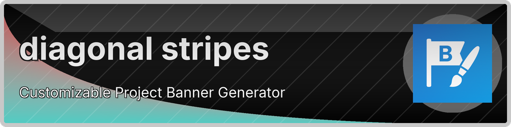
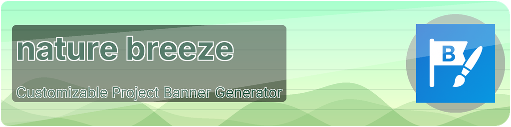
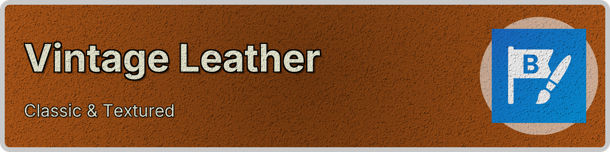

# Complete Preset Gallery

This document showcases all 43 available design presets for Banner Maker. Each preset is a carefully crafted combination of colors, gradients, patterns, shapes, textures, and effects.

## Quick Usage

```bash
# Use any preset with your content
python banner_maker.py --preset PRESET_NAME --title "Your Title"

# Learn the CLI equivalent of any preset
python banner_maker.py --learn PRESET_NAME
```

## All Presets (A-Z)

### Accessible Blue Orange
**Perfect for:** High contrast accessibility, color-blind friendly designs
```bash
python banner_maker.py --preset accessible_blue_orange --title "Your Project"
```


### Accessible Purple Yellow
**Perfect for:** High contrast accessibility, color-blind friendly designs
```bash
python banner_maker.py --preset accessible_purple_yellow --title "Your Project"
```


### Architect Concrete
**Perfect for:** Architecture, construction, minimalist professional projects
```bash
python banner_maker.py --preset architect_concrete --title "Your Project"
```


### Auto Color
**Perfect for:** Adaptive designs that match your project icon colors
```bash
python banner_maker.py --preset auto_color --title "Your Project" --icon your_logo.png
```


### Blob Garden
**Perfect for:** Creative projects, organic designs, artistic portfolios
```bash
python banner_maker.py --preset blob_garden --title "Your Project"
```


### Business Green
**Perfect for:** Corporate projects, business solutions, professional services
```bash
python banner_maker.py --preset business_green --title "Your Project"
```


### BW High Contrast
**Perfect for:** Minimalist designs, high readability, accessibility
```bash
python banner_maker.py --preset bw_high_contrast --title "Your Project"
```


### Casual Denim
**Perfect for:** Casual projects, lifestyle brands, informal documentation
```bash
python banner_maker.py --preset casual_denim --title "Your Project"
```


### Cyber Yellow
**Perfect for:** Tech projects, futuristic themes, innovative products
```bash
python banner_maker.py --preset cyber_yellow --title "Your Project"
```


### Dark Portfolio
**Perfect for:** Creative portfolios, artistic projects, modern designs
```bash
python banner_maker.py --preset dark_portfolio --title "Your Project"
```


### Diagonal Stripes
**Perfect for:** Clean geometric designs, modern corporate branding
```bash
python banner_maker.py --preset diagonal_stripes --title "Your Project"
```


### Diagonal Stripes Bold
**Perfect for:** Bold geometric designs, attention-grabbing headers
```bash
python banner_maker.py --preset diagonal_stripes_bold --title "Your Project"
```


### Edu Blue
**Perfect for:** Educational projects, learning platforms, academic content
```bash
python banner_maker.py --preset edu_blue --title "Your Project"
```


### Energy Orange
**Perfect for:** High-energy projects, sports, dynamic applications
```bash
python banner_maker.py --preset energy_orange --title "Your Project"
```


### Fintech Gold
**Perfect for:** Financial services, premium products, luxury branding
```bash
python banner_maker.py --preset fintech_gold --title "Your Project"
```


### Flat Minimal
**Perfect for:** Ultra-clean designs, modern minimalism, simple interfaces
```bash
python banner_maker.py --preset flat_minimal --title "Your Project"
```


### Geometric Chaos
**Perfect for:** Creative projects, design portfolios, artistic endeavors
```bash
python banner_maker.py --preset geometric_chaos --title "Your Project"
```


### Geometric Polygons
**Perfect for:** Modern geometric designs, tech startups, innovative projects
```bash
python banner_maker.py --preset geometric_polygons --title "Your Project"
```


### GitHub Pro
**Perfect for:** Open source projects, developer tools, GitHub repositories
```bash
python banner_maker.py --preset github_pro --title "Your Project"
```


### Green Soft
**Perfect for:** Nature projects, wellness apps, eco-friendly brands
```bash
python banner_maker.py --preset green_soft --title "Your Project"
```


### Healthcare Mint
**Perfect for:** Healthcare projects, medical apps, wellness platforms
```bash
python banner_maker.py --preset healthcare_mint --title "Your Project"
```


### Layered Shapes
**Perfect for:** Complex designs, artistic projects, creative portfolios
```bash
python banner_maker.py --preset layered_shapes --title "Your Project"
```


### Matrix Grid
**Perfect for:** Tech projects, coding tools, digital matrix themes
```bash
python banner_maker.py --preset matrix_grid --title "Your Project"
```


### Modern Blue
**Perfect for:** Professional projects, corporate branding, tech startups
```bash
python banner_maker.py --preset modern_blue --title "Your Project"
```


### Multi Waves
**Perfect for:** Dynamic designs, fluid interfaces, modern applications
```bash
python banner_maker.py --preset multi_waves --title "Your Project"
```


### Nature Breeze
**Perfect for:** Environmental projects, outdoor brands, nature themes
```bash
python banner_maker.py --preset nature_breeze --title "Your Project"
```


### Neon Retro
**Perfect for:** Gaming projects, retro themes, cyberpunk aesthetics
```bash
python banner_maker.py --preset neon_retro --title "Your Project"
```


### Ocean Waves
**Perfect for:** Nature projects, environmental themes, calming designs
```bash
python banner_maker.py --preset ocean_waves --title "Your Project"
```


### Orange Blue
**Perfect for:** Vibrant contrasts, energetic designs, creative projects
```bash
python banner_maker.py --preset orange_blue --title "Your Project"
```


### Organic Blobs
**Perfect for:** Natural designs, fluid interfaces, organic shapes
```bash
python banner_maker.py --preset organic_blobs --title "Your Project"
```


### Pastel Leaf
**Perfect for:** Soft designs, gentle themes, nature-inspired projects
```bash
python banner_maker.py --preset pastel_leaf --title "Your Project"
```


### Perfect Circles
**Perfect for:** Simple geometric designs, clean minimalism
```bash
python banner_maker.py --preset perfect_circles --title "Your Project"
```


### Polygon Constellation
**Perfect for:** Cosmic themes, geometric art, creative portfolios
```bash
python banner_maker.py --preset polygon_constellation --title "Your Project"
```


### Purple Tech
**Perfect for:** Tech projects, innovative products, modern applications
```bash
python banner_maker.py --preset purple_tech --title "Your Project"
```


### Sunny Morning
**Perfect for:** Cheerful projects, positive themes, bright applications
```bash
python banner_maker.py --preset sunny_morning --title "Your Project"
```


### Sunset Stream
**Perfect for:** Warm themes, relaxing applications, evening vibes
```bash
python banner_maker.py --preset sunset_stream --title "Your Project"
```


### Sunset Stream Dark
**Perfect for:** Dark themes with warm accents, evening applications
```bash
python banner_maker.py --preset sunset_stream_dark --title "Your Project"
```


### Textile Corduroy
**Perfect for:** Fabric textures, casual brands, tactile designs
```bash
python banner_maker.py --preset textile_corduroy --title "Your Project"
```


### Vaporwave
**Perfect for:** Retro projects, gaming, nostalgic themes
```bash
python banner_maker.py --preset vaporwave --title "Your Project"
```


### Vintage Leather
**Perfect for:** Classic projects, luxury branding, traditional themes
```bash
python banner_maker.py --preset vintage_leather --title "Your Project"
```


### Water Reflection
**Perfect for:** Calm designs, reflective themes, peaceful projects
```bash
python banner_maker.py --preset water_reflection --title "Your Project"
```


### Wave Dynamics
**Perfect for:** Dynamic motion, fluid designs, energetic projects
```bash
python banner_maker.py --preset wave_dynamics --title "Your Project"
```


### Writer Beige
**Perfect for:** Writing projects, documentation, minimalist content
```bash
python banner_maker.py --preset writer_beige --title "Your Project"
```


## Quick Reference by Category

### Professional & Business
- **modern_blue** - Clean professional design
- **business_green** - Corporate green theme
- **github_pro** - GitHub-inspired styling
- **fintech_gold** - Premium financial theme
- **architect_concrete** - Minimalist professional

### Creative & Artistic
- **geometric_chaos** - Dynamic triangular patterns
- **polygon_constellation** - Star-filled geometric wonderland
- **blob_garden** - Organic flowing shapes
- **layered_shapes** - Multiple overlapping elements
- **dark_portfolio** - Sleek creative portfolio

### Tech & Futuristic
- **cyber_yellow** - Bold tech aesthetic
- **purple_tech** - Purple technological feel
- **matrix_grid** - Digital matrix patterns
- **neon_retro** - Bright cyberpunk colors

### Nature & Organic
- **nature_breeze** - Fresh natural themes
- **ocean_waves** - Flowing wave patterns
- **water_reflection** - Calming water designs
- **organic_blobs** - Soft natural shapes
- **pastel_leaf** - Gentle nature colors

### Accessible Design
- **accessible_blue_orange** - High contrast blue-orange
- **accessible_purple_yellow** - High contrast purple-yellow
- **bw_high_contrast** - Black and white high contrast

## Usage Tips

```bash
# Generate examples of all presets
python banner_maker.py --demo

# Learn CLI equivalent of any preset
python banner_maker.py --learn preset_name

# Customize any preset with accent colors
python banner_maker.py --preset PRESET_NAME --accent "your_color"

# Apply global modifiers
python banner_maker.py --preset PRESET_NAME --intensity "high" --rounded "20"
```

---

*All 43 presets are designed to showcase different aspects of Banner Maker's capabilities while providing ready-to-use professional designs.*